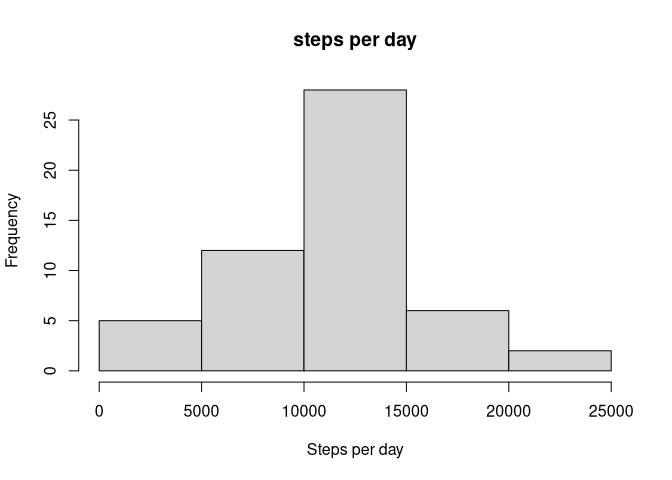
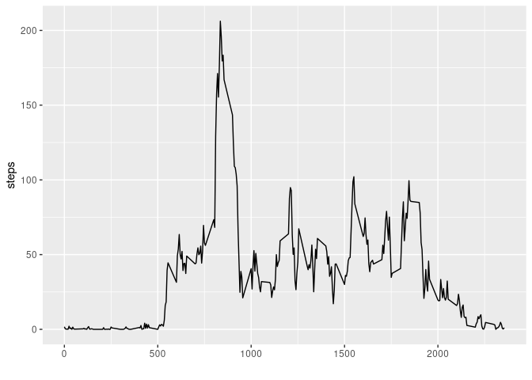
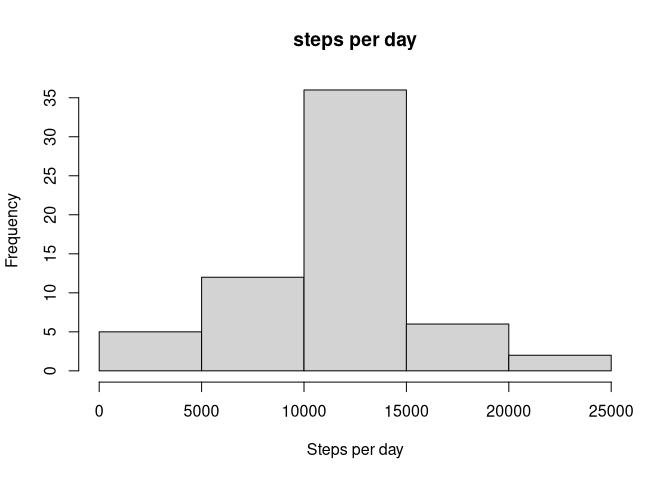
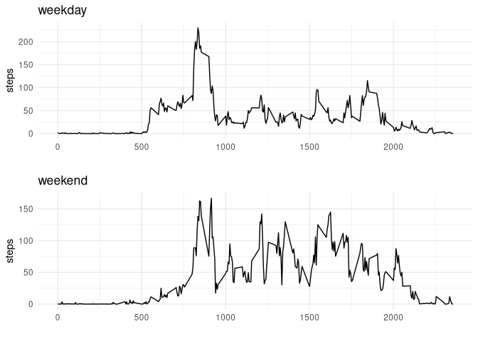

## Loading and preprocessing the data

1. Data is loaded using the following code:

```r
data = read.csv("activity.csv")
```

No further processing is done, and will be done only when needed in the succeeding items.

## What is mean total number of steps taken per day?
Missing values are ignored, thus removed as shown below. After this step, all non-`NA` data are contained in `gooddata`.

```r
library("dplyr")
```

```
## 
## Attaching package: 'dplyr'
```

```
## The following objects are masked from 'package:stats':
## 
##     filter, lag
```

```
## The following objects are masked from 'package:base':
## 
##     intersect, setdiff, setequal, union
```

```r
gooddata = filter(data, !is.na(steps))
```


1. The total steps is computed first, per day. Afterwards, the histogram of the total number of steps taken each day is shown.

```r
steps_per_day = aggregate(x = gooddata$steps, by = list((gooddata$date)), FUN=sum)
hist(steps_per_day$x, xlab="Steps per day", main="steps per day")
```

<!-- -->

2. The mean and median are computed as follows using the previously created variable `steps_per_day` where the total are aggregated.

```r
mean(steps_per_day$x)
```

```
## [1] 10766.19
```

```r
median(steps_per_day$x)
```

```
## [1] 10765
```

## What is the average daily activity pattern?

Data is again aggregated, in this case, per interval. Result will be stored in `mydata`.

```r
steps_per_interval = aggregate(x = gooddata$steps, by = list((gooddata$interval)), FUN=mean)
steps_per_interval <- mutate(steps_per_interval, interval=Group.1)
mydata <- select(steps_per_interval, interval, steps=x)
```

1. Below is the time series plot of the 5-minute intervals against the average steps per interval.

```r
library(ggplot2)
ggplot(mydata, aes(x=interval,y=steps)) +
  geom_line() +
  xlab("")
```

<!-- -->

2. The max average number of steps was obtained on the interval below:

```r
filter(mydata,steps==max(steps))
```

```
##   interval    steps
## 1      835 206.1698
```

## Inputing missing values

1. The total number of missing values (i.e. `NA`) in the data is computed by subtracting the number of rows in `gooddata` (data frame without the missing values) from `data` (the raw data).

```r
nrow(data)-nrow(gooddata)
```

```
## [1] 2304
```

2. The missing values will be filled in by the mean per interval using the function below. This basically assigns the mean per interval to the `NA`s based on their corresponding interval.

```r
#function for filling the missing values
fillNA <- function(data,steps_per_interval){
  for(i in 1:nrow(data)){
      if(is.na(data[i,"steps"])){
        intv = filter(steps_per_interval, interval==data[i,"interval"])
        intv = select(intv, x)
        intv = intv[,1]
        
        data[i,"steps"] = intv
      }
   }
   data
}
```

3. Below is the code for filling in the `NA`s with the mean per respective interval.

```r
filled <- fillNA(data, steps_per_interval)
```

4. The same code (using different variables) will be used to create the histogram and mean/median values:

Below is the historgram:

```r
steps_per_day = aggregate(x = filled$steps, by = list((filled$date)), FUN=sum)
hist(steps_per_day$x, xlab="Steps per day", main="steps per day")
```

<!-- -->

Below are the new mean and median values:

```r
mean(steps_per_day$x)
```

```
## [1] 10766.19
```

```r
median(steps_per_day$x)
```

```
## [1] 10766.19
```

**Observation:** It didn't differ much from the original analysis where we ignored the missing values.

## Are there differences in activity patterns between weekdays and weekends?

1. Here, another variable is added to the data set which classifies if the date is a weekday or weekend:

```r
filled$day <- weekdays(as.Date(filled$date))
filled[which(filled$day=="Monday"),"day"] <- "weekday"
filled[which(filled$day=="Tuesday"),"day"] <- "weekday"
filled[which(filled$day=="Wednesday"),"day"] <- "weekday"
filled[which(filled$day=="Thursday"),"day"] <- "weekday"
filled[which(filled$day=="Friday"),"day"] <- "weekday"
filled[which(filled$day=="Saturday"),"day"] <- "weekend"
filled[which(filled$day=="Sunday"),"day"] <- "weekend"
```

2. The average for each interval is computed just like in the previous computation, but now, the data is divided into two categories: `weekday` and `weekend`.

```r
weekday <- filter(filled, day=="weekday")
wday_int = aggregate(x = weekday$steps, by = list((weekday$interval)), FUN=mean)
wday_int <- mutate(wday_int, interval=Group.1)
wday_int <- select(wday_int, interval, steps=x)

weekend <- filter(filled, day=="weekend")
wend_int = aggregate(x = weekend$steps, by = list((weekend$interval)), FUN=mean)
wend_int <- mutate(wend_int, interval=Group.1)
wend_int <- select(wend_int, interval, steps=x)
```

Once the data is processed, plots for each dataset will be created.

```r
wday.mpg <- ggplot(wday_int, aes(x=interval, y=steps)) + geom_line() + xlab("") + ggtitle("weekday") + theme_minimal()
wend.mpg <- ggplot(wend_int, aes(x=interval, y=steps)) + geom_line() + xlab("") + ggtitle("weekend") + theme_minimal()
```

And then combined using `ggarrange`:

```r
library(egg)
```

```
## Loading required package: gridExtra
```

```
## 
## Attaching package: 'gridExtra'
```

```
## The following object is masked from 'package:dplyr':
## 
##     combine
```

```r
ggarrange(wday.mpg, wend.mpg, nrow=2)
```

<!-- -->
